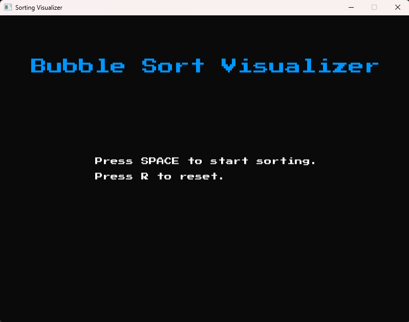
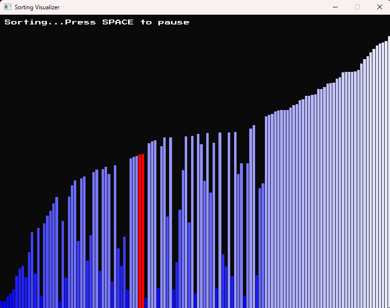
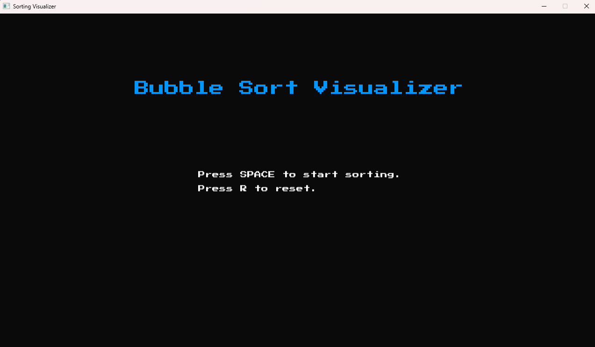
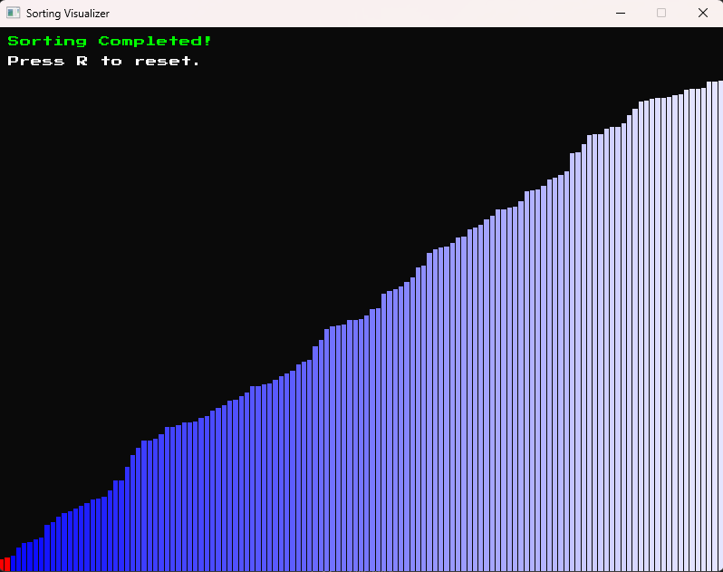
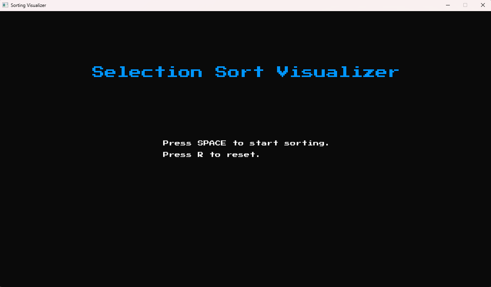
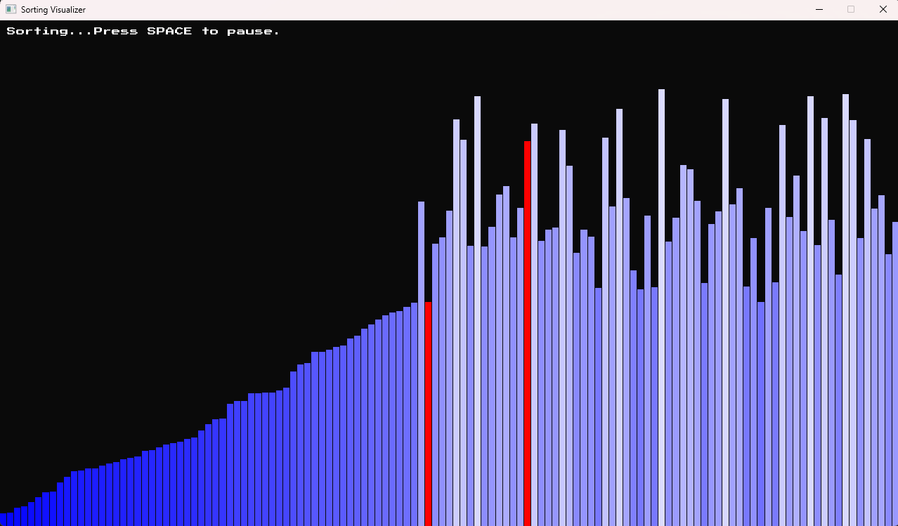
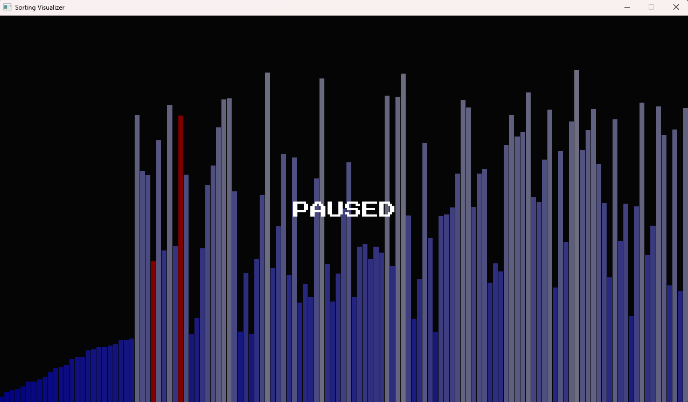
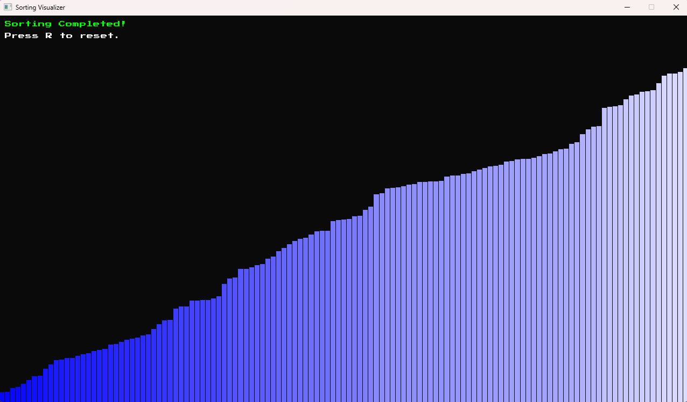

# SFML Sorting Visualizer

A simple **Sorting Visualizer** built with **SFML-3.0.0 in C++**.

This project demonstrates how **Bubble Sort** and **Selection Sort** algorithms work step by step.

## Features
- Visualizes the following algorithms:
    - **Bubble Sort** (compares adjacent elements, sorts right -> left per pass)
    - **Selection Sort** (selects smallest element, sorts left -> right per pass)
- **Start, pause and reset** sorting using keyboard controls:
    - **SPACE**: Start/Pause sorting
    - **R**: Reset the array
- **Adjustable sorting speed** with keyboard controls:
    - **UP Arrow**: Increase speed (faster sorting)
    - **DOWN Arrow**: Decrease speed (slower sorting)

## Controls
| Key | Action |
|-----|--------|
| **SPACE** | Start / Pause sorting |
| **R** | Reset and shuffle array |
| **B** | Select Bubble Sort |
| **S** | Select Selection Sort |
| **↑ (Up Arrow)** | Increase sorting speed |
| **↓ (Down Arrow)** | Decrease sorting speed |

## Requirements
- C++17 or later
- [SFML 3.0.0](https://www.sfml-dev.org/download/)

## Screenshots

    
    

    
    

    
    

    
    

