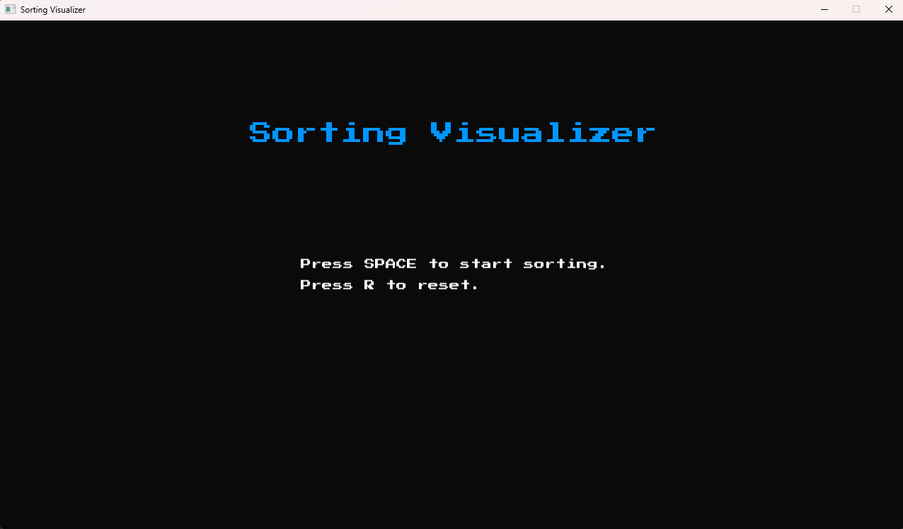
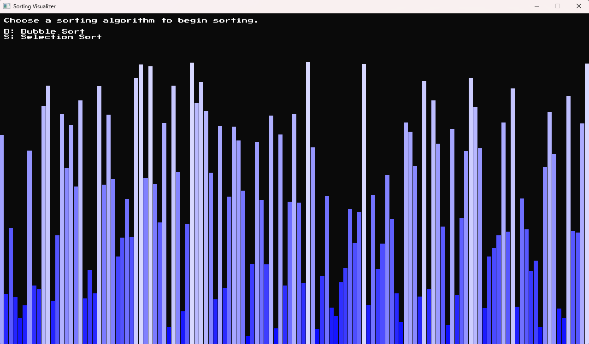
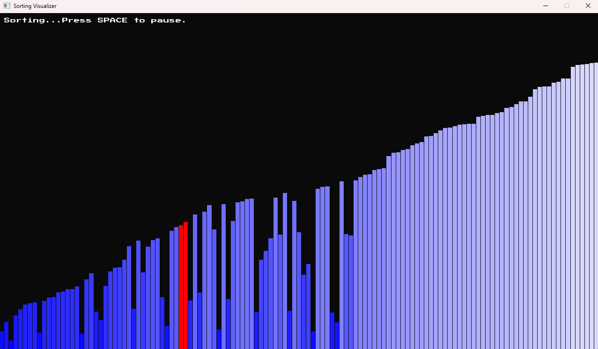

# SFML Bubble Sort Visualizer

A simple **Bubble Sort Visualizer** built with **SFML-3.0.0 in C++**.

This project demonstrates the bubble sort algorithm.

## Features
- Visualizes the **Bubble Sort** algorithm step by step.
- **Start, pause and reset** sorting using keyboard controls:
    - **SPACE**: Start/Pause sorting
    - **R**: Reset the array
- **Adjustable sorting speed** with keyboard controls:
    - **UP Arrow**: Increase speed (faster sorting)
    - **DOWN Arrow**: Decrease speed (slower sorting)

## Requirements
- C++17 or later
- [SFML 3.0.0](https://www.sfml-dev.org/download/)

## Screenshots

